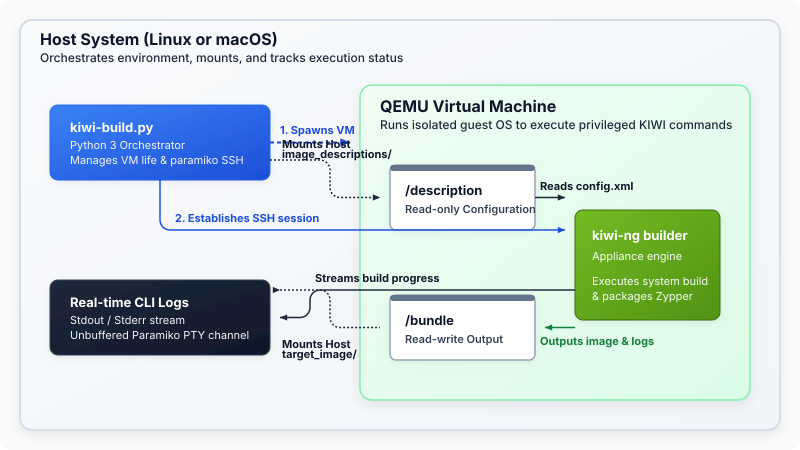

# QEMU Native KIWI Box Builder (`qemu-kiwi-build`)

A lightweight, portable utility to run automated SUSE KIWI (`kiwi-ng`) appliance builds inside a native QEMU virtual machine on both **Linux** and **macOS**. 

By leveraging native QEMU and standard SSH communication via Python's `paramiko`, this tool provides real-time, line-buffered logs and avoids the need for heavy containerized/Vagrant virtualization layers while maintaining complete environment isolation.

---

## Table of Contents

- [Overview & Architecture](#overview--architecture)
- [How It Works](#how-it-works)
- [Prerequisites](#prerequisites)
- [Directory Structure](#directory-structure)
- [Getting Started](#getting-started)
- [Command Line Usage](#command-line-usage)
  - [Available Arguments](#available-arguments)
  - [Supported Image Configurations](#supported-image-configurations)
- [Parallels Guest Tools Integration](#parallels-guest-tools-integration)
- [Technical Highlights & Design Patterns](#technical-highlights--design-patterns)

---

## Overview & Architecture

Building OS appliances with [SUSE KIWI](https://osuse_opensuse_org.github.io/kiwi/) often requires running the tool on the target OS or inside a privileged VM with kernel-level capabilities to create filesystems, bootstrap packages, and build partition tables.

This project solves this by orchestrating a headless **QEMU virtual machine** that boots a pre-configured openSUSE/Ubuntu "box" system. The host's selected image description and output directories are shared with the guest VM using native **VirtIO-9p** folder sharing. Commands are executed inside the guest VM via an automated SSH connection, streaming unbuffered, real-time stdout and stderr output back to your host terminal.



---

## How It Works

1. **Local Bootstrapping**: The `kiwi-build.py` script automatically initializes a Python 3 virtual environment (`.venv`) and installs the required `paramiko` SSH package if not already present.
2. **Box Caching**: It downloads the specified build box (system image and kernel bundle) from the openSUSE Build Service (OBS) into the local directory (`./kiwi_boxes/`) if not already cached.
3. **Environment Injection**: If Parallels Tools or any overlays are required, they are automatically placed into the image description overlays.
4. **VM Bootstrapping**: QEMU is launched headlessly. The script monitors stdout for login readiness, automatically configures guest networking/SSH, sets root credentials, and starts the SSH daemon.
5. **KIWI Build execution**: It connects to the VM over SSH and issues build instructions:
   - Mounts the selected OS image description folder as `/description` (via `virtio-9p`).
   - Mounts the target output bundle folder as `/bundle` (via `virtio-9p`).
   - Runs `kiwi-ng system build` inside the guest OS.
   - Streams build step progress, zypper downloads, and warnings in real-time.
6. **Graceful Teardown**: Shuts down the VM, moves and names the build logs with timestamps, cleans up description overlays, and writes the exit code to `target_image/result.code` for CI pipeline integration.

---

## Prerequisites

- **Python 3.6+**: Standard Python installation.
- **QEMU**:
  - **Linux**: Install via package manager (e.g., `sudo zypper in qemu-x86` or `sudo apt install qemu-system-x86`). Ensure KVM modules are loaded (`/dev/kvm` is writable) for hardware acceleration.
  - **macOS**: Install via Homebrew (`brew install qemu`). The script will automatically use Apple's Hypervisor Framework (`HVF`) for hardware acceleration.

---

## Directory Structure

```
qemu-kiwi-build/
├── .gitignore                   # Ignore rules for local virtual environment, ISOs, boxes, and output
├── kiwi-build.py                # Main orchestration entrypoint (Python script)
├── README.md                    # Project documentation (this file)
│
├── image_descriptions/          # Organized folder for different OS image descriptions
│   ├── opensuse_leap_15.6/      # openSUSE Leap 15.6 config and scripts
│   │   ├── config.xml           # Leap 15.6 KIWI image configuration (profiles, packages)
│   │   └── config.sh            # Post-install script executed during Leap 15.6 image build
│   └── opensuse_leap_16.0/      # openSUSE Leap 16.0 config and scripts (Leap 16)
│       ├── config.xml           # Leap 16.0 KIWI image configuration (profiles, packages)
│       └── config.sh            # Post-install script executed during Leap 16.0 image build
│
├── parallels_iso/               # Cache folder for Parallels Guest Tools ISOs
│   └── README.md                # Guide on locating and naming Parallels tools ISO files
│
├── kiwi_boxes/                  # Automatically created; caches downloaded VM system QCow2 images & kernels
│   ├── leap/
│   └── tumbleweed/
│
└── target_image/                # Automatically created; output folder where built images and logs are stored
```

---

## Getting Started

To run a default build using the openSUSE Leap 15.6 description (`leap15` default):

```bash
python3 kiwi-build.py
```

To run a build using the openSUSE Leap 16.0 description (`leap16`):

```bash
python3 kiwi-build.py -i leap16
```

*Note: On your first run, the script will create `.venv`, install `paramiko`, download the system box image (~200MB to ~500MB), and then launch the build. Subsequent runs will use the cached box immediately.*

---

## Command Line Usage

### Available Arguments

You can pass several options to `kiwi-build.py` to customize the virtual machine or the target KIWI build.

```bash
usage: kiwi-build.py [-h] [-i {leap15,leap16}] [-b {leap,tumbleweed,ubuntu,universal}]
                     [-p PROFILE] [-a ARCH] [-o OUTPUT_DIR] [-c CACHE_DIR]
                     [-d DESC_DIR] [-r REPO_URL] [-m MEMORY] [-s SMP]
                     [--cpu CPU] [--machine MACHINE] [--accel {auto,true,false}]
                     [--no-parallels] [-S PARALLELS_DIR] [-l] [-v] [-n] [--debug]
```

| Argument | Short | Default | Description |
| :--- | :--- | :--- | :--- |
| `--image` | `-i` | `leap15` | Select target image to build: `leap15` (Leap 15.6) or `leap16` (Leap 16.0) |
| `--box` | `-b` | `leap` | The distribution template box to use: `leap`, `tumbleweed`, `ubuntu`, `universal` |
| `--profile` | `-p` | `Vagrant` | KIWI build profile to run (e.g. `Vagrant`, `kvm`, `VMware`, `MS-HyperV`, `Cloud`, etc.) |
| `--arch` | `-a` | *Host Arch* | Target architecture: `x86_64` or `aarch64` |
| `--output-dir`| `-o` | `./target_image`| Host output folder where built appliance images and logs are exported |
| `--cache-dir` | `-c` | `./kiwi_boxes` | Host folder where downloaded box OS system images are cached |
| `--desc-dir`  | `-d` | *Dynamic* | Host folder containing the KIWI image definition files (set dynamically by `--image`) |
| `--repo-url`  | `-r` | *Dynamic* | URL of the package repository used to bootstrap the KIWI image (set dynamically by `--image`) |
| `--memory`    | `-m` | `8192` (MB) | Host memory in MB to allocate to the build VM |
| `--smp`       | `-s` | `4` | Number of CPU cores to allocate to the build VM |
| `--cpu`       | | *Auto* | Optional QEMU CPU model override (e.g., `host`, `max`) |
| `--machine`   | | *Auto* | Optional QEMU machine model override (e.g., `virt`) |
| `--accel`     | | `auto` | Enable/disable hardware acceleration (`auto`, `true`, `false`) |
| `--no-parallels` | | `False` | Disable Parallels Guest Tools overlays and skip installation |
| `--parallels-dir`| `-S`| `./parallels_iso` | Directory containing Parallels Guest Tools ISO files |
| `--list-boxes`| `-l` | | List all supported build box configurations and exit |
| `--verbose`   | `-v` | `False` | Show raw QEMU serial console output in addition to build logs |
| `--dry-run`   | `-n` | `False` | Print the formulated QEMU command and exit without starting the VM |
| `--debug`     | | `False` | Run `kiwi-ng` in debug mode inside the VM (verbose progress output) |

### Examples

**1. Build the new openSUSE Leap 16.0 image configuration:**
```bash
python3 kiwi-build.py -i leap16
```

**2. Build for Apple Silicon (AArch64) on an M1/M2/M3 Mac using openSUSE Leap 16.0:**
```bash
python3 kiwi-build.py -i leap16 -b tumbleweed -a aarch64 -p Vagrant
```

**3. List all available VM build templates:**
```bash
python3 kiwi-build.py --list-boxes
```

**4. Run with full verbose VM booting sequence logs:**
```bash
python3 kiwi-build.py -v
```

**5. Run with custom memory allocation and raw repository overrides:**
```bash
python3 kiwi-build.py -m 16384 -s 8 -r "https://download.opensuse.org/tumbleweed/repo/oss/"
```

---

## Parallels Guest Tools Integration

If you want to build a Vagrant box compatible with **Parallels Desktop**, the tool supports automatic installation of the guest tools:

1. Locate the Parallels tools ISO files on your system (see `./parallels_iso/README.md` for standard paths on macOS, Windows, and Linux).
2. Copy them into `./parallels_iso/`:
   - `prl-tools-lin.iso` (for `x86_64`)
   - `prl-tools-lin-arm.iso` (for `aarch64` / Apple Silicon)
3. Ensure `--no-parallels` is not set.
4. Run the script. The orchestrator will automatically swap the profile to `Vagrant-parallels`, copy the tools into the image overlay path dynamically, mount it as a loop device during chroot build execution, compile kernel modules, and cleanly remove them afterwards.

---

## Technical Highlights & Design Patterns

* **Self-Bootstrapping**: No `pip install` or virtual environment setup is required on the host system. The script takes care of virtualenv initialization, activation, and missing dependencies (`paramiko`) at startup.
* **Upstream Template Alignment**: The `config.xml` and `config.sh` files for `leap15` and `leap16` are derived entirely from the official Open Build Service (OBS) `Minimal.kiwi` templates, augmented cleanly with automatic Vagrant user registration and seamless Parallels Tools installation handlers.
* **macOS Slirp Port Wedging Avoidance**: Connecting to local port forwardings (`127.0.0.1:10022`) too early can cause slirp connections to lock up on certain macOS architectures. The script avoids this by waiting for QEMU serial-stdout to emit boot-ready markers before starting any TCP connections.
* **Host xattr & 9p Permission Handover**: Different operating systems support different Extended Attributes (`xattr`). The script automatically assays directory compatibility to configure the correct 9p filesystem security model (`mapped-xattr`, `mapped`, or `none`).
* **Automated CI Readiness**: Writes a standard `result.code` file containing the guest command execution exit status, making it effortless to run inside GitLab CI, GitHub Actions, or Jenkins.
